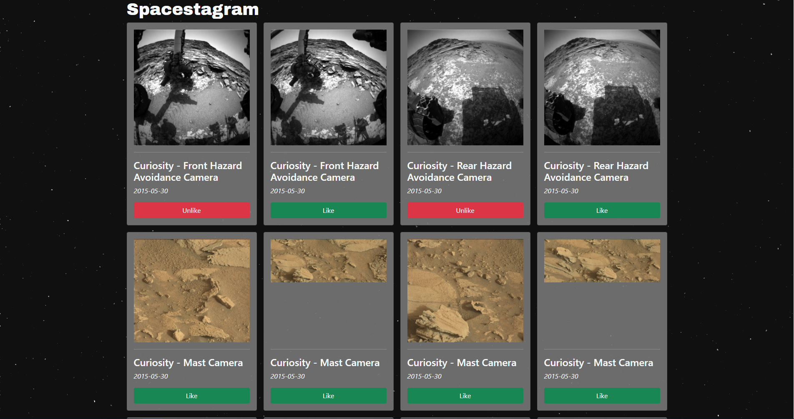
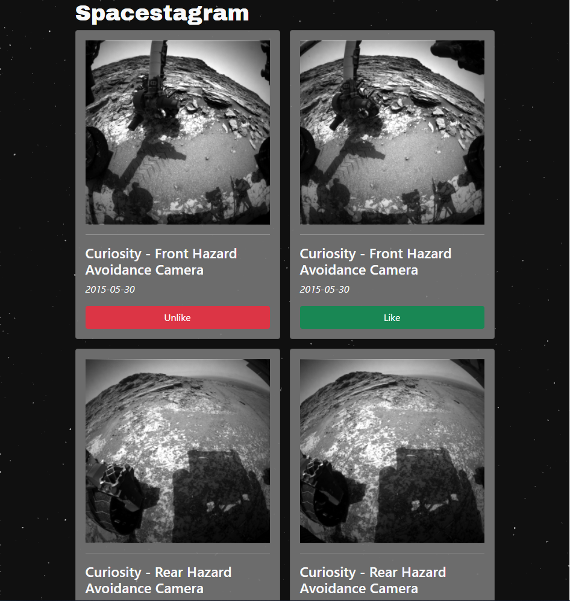
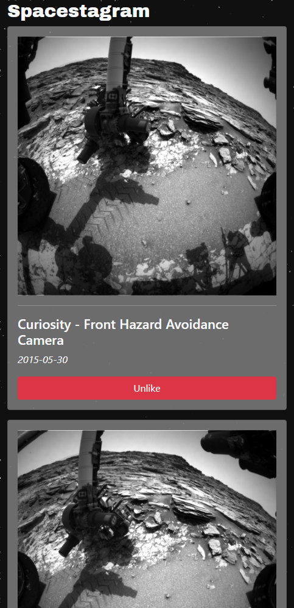

# Spacestagram

This app pulls 25 images taken by the Curiosity Mars Rover using the NASA Mars Rover Photos API. The images are displayed in a responsive grid, and can be liked or unliked. The liked status of each image is stored in localstorage to persist on page reloads. The project was built for the Shopify Front End Developer Intern Challenge - Winter 2022.

## Technology Used

- NASA API (Mars Rover Photos)
- ReactJS
- CSS3
- Bootstrap 5
- Gimp (to generate background image)
- Heroku

## Deployment

This app was deployed using Heroku. It can be viewed [here](https://spacestagram-jesse.herokuapp.com/).

### `Local Hosting Instructions`

To create a local copy of this project, create a .env file in the root folder after cloning the repository.

In the .env file, add the following: `REACT_APP_API_KEY = 'your API key goes here'`

## Project Images

### `Desktop View`

### `Tablet View`

### `Mobile View`

